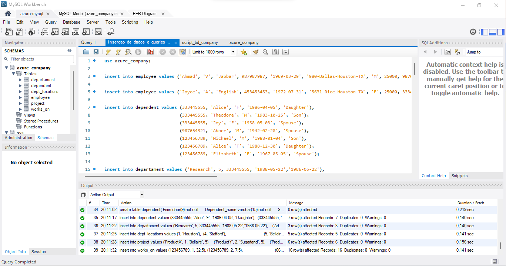
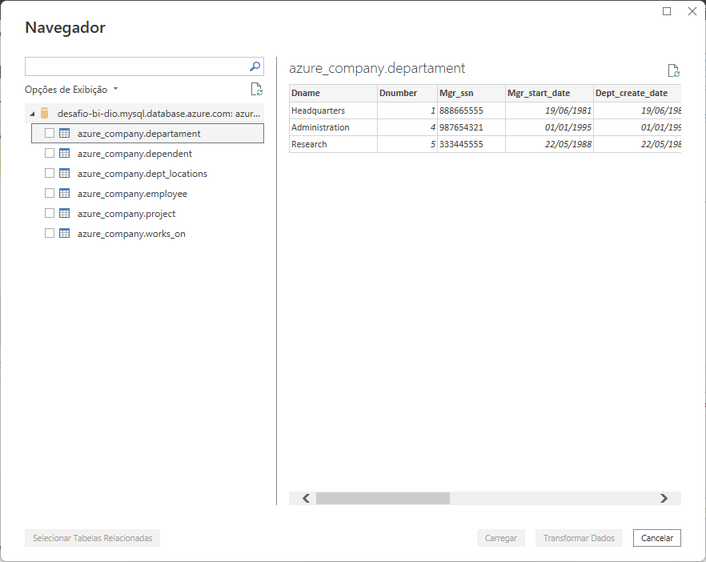
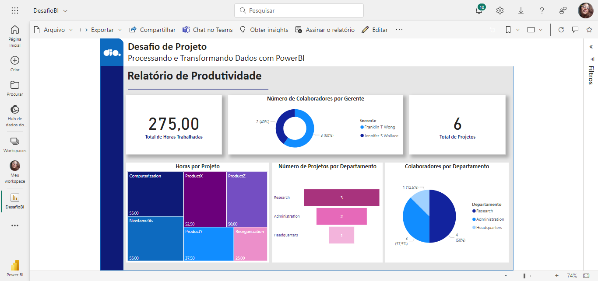

# Desafio Processando e Transformando Dados com PowerBI
## Objetivo
Aplicar as etapas de coleta, obtenção e transformação de dados com Power BI e MySQL na Azure.
## Tarefas
As tarefas que compõem o desafio estão registradas em capturas de tela e em arquivos submetidos nesse repositório.

- [x] 1. Criação de uma instância na Azure para MySQL
      

- [x] 2. Criar o Banco de dados com base disponível no [GitHub](https://github.com/julianazanelatto/power_bi_analyst)
      

- [x] 3. Integração do PowerBI com MySQL no Azure

- [x] 4. Verificar problemas na base a fim de realizar a transformação de dados

## Passo a passo da transformação de dados
1. Primeiramente foram removidas as colunas referentes a chaves estrangeiras.
2. Em seguida, os nomes das colunas foram renomeados para que ficassem mais declarativas e padronizadas com o formato Camel Case, mantendo 
o idioma inglês nas consultas.
3. O tipo de dados de valores monetários foi alterado para decimal fixo.
4. As colunas referentes aos nomes de employee foram mescladas com separador de espaço para que houvesse apenas uma coluna de nome.
5. Foi verificado que havia apenas um valor nulo na tabela, porém ele pode significar que o colaborador não possui gerente devido ao seu cargo e
departamento na empresa.
6. A coluna complexa de endereço foi dividida em quatro seguindo o processo:
  6.1. Deduziu-se que o formato de endereço é número-rua-cidade-estado.
  6.2. Notou-se que existia um nome de rua que dificultaria a divisão de colunas usando o '-' como separador. Logo, o valor Fire-Oak foi
substituído por Fire Oak.
  6.3. Com a alteração foi possível usar o recurso Dividir Coluna usando o separador '-'.
  6.4. O nome Fire Oak foi retornado para Fire-Oak, para manter a coerência com os dados originais.
  6.5. A coluna de estado foi removida pois todos os valores eram iguais, significando que os dados foram obtidos em único estado.
7. Foi criada uma nova tabela duplicada de works_on. Em seguida, a coluna com o ssn de employee foi removida e as colunas de project e hour
foi agrupada usando a operação soma, gerando a nova tabela hours_project com a soma de horas por projeto.
8. Foi criada uma nova tabela com a mescla de employee e departament para obter o nome dos departamentos segundo o seu número. As colunas desnecessárias
foram removidas, resultando em uma tabela com apenas as colunas employee e nome do departamento.
9. Tendo a tabela resultante no passo anterior como base, foi feita a mescla com a tabela departament para obter o ssn do gerente de cada departamento. 
As colunas desnecessárias foram removidas.
10. Mais uma operação de Mesclar Consultas foi realizada, dessa vez com a tabela de employee para obter os respectivos nomes dos gerentes.
11. Em seguida, as colunas foram agrupadas pela operação contar linhas. Com o auxílio da query gerada na Linguagem M, subtraiu-se uma unidade de 
cada linha da nova coluna com o número de colaboradores por gente, já que haviam linhas com redundâncias (o gerente constava como gerente de si mesmo).
A tabela gerada foi nomeada employee_manager.
12. Para que se gerasse o gráfico de colaboradores por departamento, criou-se a tabela employee_departament de forma semelhante à employee_management.

## Relatório Publicado

## Feeback
Tive dificuldade em separar os dados por região. Apesar de ter entendido a contextualização da base de dados, não consegui fazer o tratamento devido para que esses dados ficassem devidamente representados no relatório. Reconheço que o relatório gerado não reflete a realidade dos dados. Apresento as habilidades que adquiri durante o curso Processando e Transformando Dados com PowerBI durante o prazo que me foi possível. 
